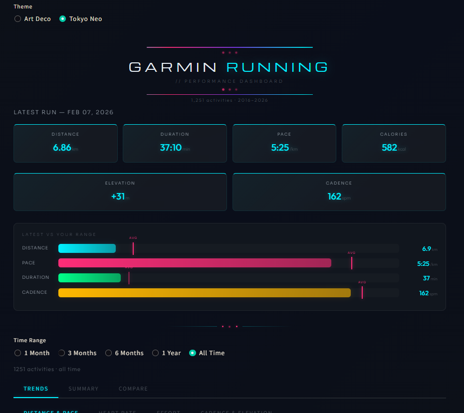
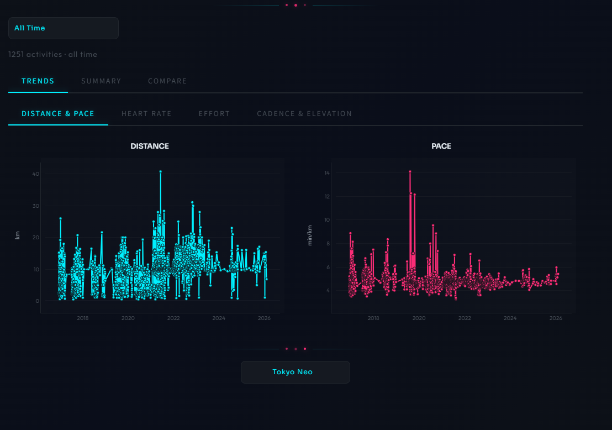
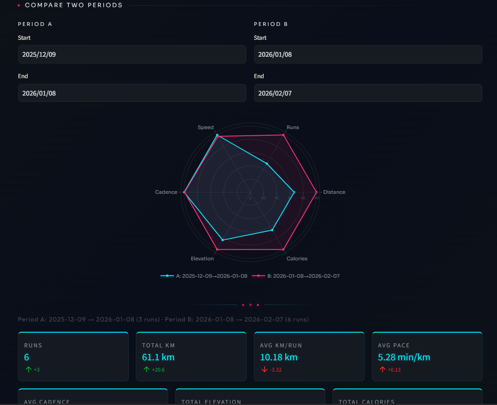
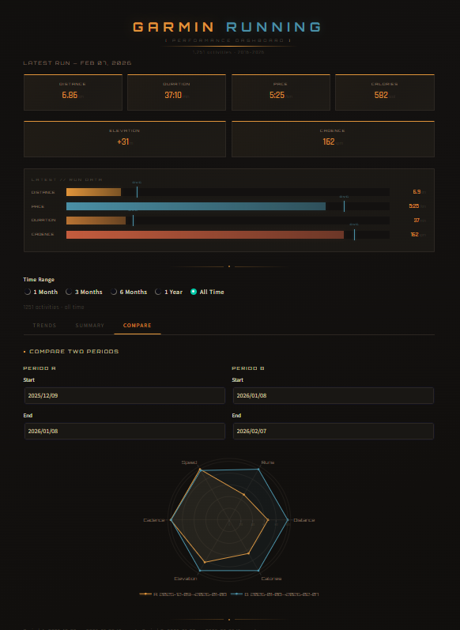
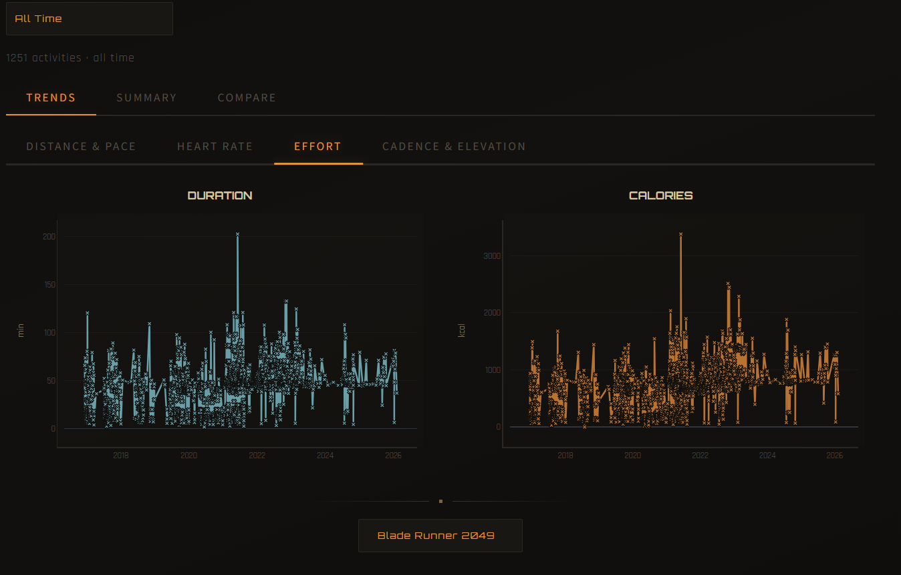

# Garmin Activity Puller

[](https://github.com/gommezen/garmin-activity/releases)
[](https://python.org)
[](https://streamlit.io)
[](https://plotly.com)
[](https://pandas.pydata.org)
[](https://numpy.org)
[](https://sqlite.org)
[](https://connect.garmin.com)
[](LICENSE)

A Python CLI that pulls your running activities from Garmin Connect, stores them in SQLite, and visualizes trends via a Streamlit dashboard or Jupyter notebook. Features multi-theme UI with Art Deco, Tokyo Neo, and Blade Runner 2049 aesthetics, period comparison, personal records, and animated visual boards.

## Screenshots

### Tokyo Neo Theme
<p align="center">
  
</p>
<p align="center">
  
</p>
<p align="center">
  
</p>

### Blade Runner 2049 Theme
<p align="center">
  
</p>
<p align="center">
  
</p>

## Features

- **Pull** running activities from Garmin Connect with token caching and MFA support
- **Store** in SQLite with automatic deduplication and data cleaning filters
- **Visualize** via interactive Plotly charts (distance, pace, heart rate, cadence, elevation, calories)
- **Themes** — Art Deco (emerald/jade + noir), Tokyo Neo (neon cyan + hot pink), and Blade Runner 2049 (dusty amber + steel blue) with hover effects
- **Compare** any two time periods side-by-side with delta indicators and radar chart
- **Summary** stats — weekly/monthly breakdowns and personal records
- **Export** to CSV or JSON for external analysis

## Setup

**Requires Python 3.10+**

1. **Install dependencies**

   ```bash
   pip install -r requirements.txt
   ```

2. **Add your credentials** — copy `.env.example` to `.env` and fill in your Garmin email and password. If your account has MFA enabled, you'll be prompted to enter the code on first login — tokens are cached for subsequent runs.

## Usage

```bash
# Pull running activities from the last 30 days
python pull_activities.py running

# Pull with custom range and limit
python pull_activities.py running --days 90 --limit 10

# Export to JSON or CSV
python pull_activities.py running --save
python pull_activities.py running --csv

# Pull lap/split data for activities missing laps
python pull_activities.py --laps

# Show weekly/monthly summary stats and PRs
python pull_activities.py running --stats

# List all supported sport types
python pull_activities.py --list-sports
```

## Dashboard

```bash
streamlit run ui/dashboard.py
```

## Notebook

```bash
jupyter notebook notebooks/analysis.ipynb
```

## Project Structure

```
src/            Source modules (client, db, display, export, stats)
tests/          Test suite (pytest)
ui/             Streamlit dashboard with multi-theme support
notebooks/      Jupyter analysis notebook
data/           SQLite database and auth tokens (gitignored)
output/         CSV and JSON exports (gitignored)
docs/           Screenshots and documentation assets
```
